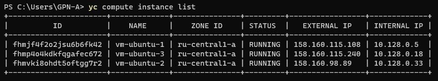
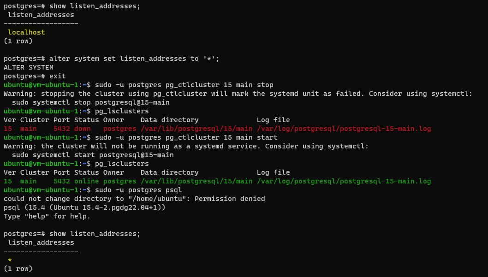
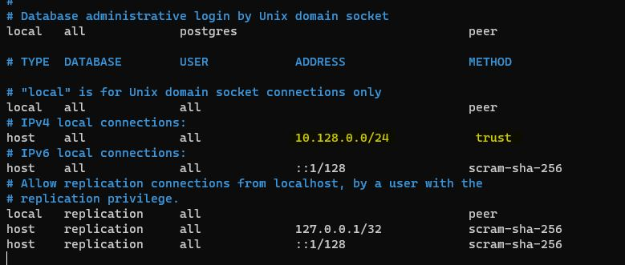
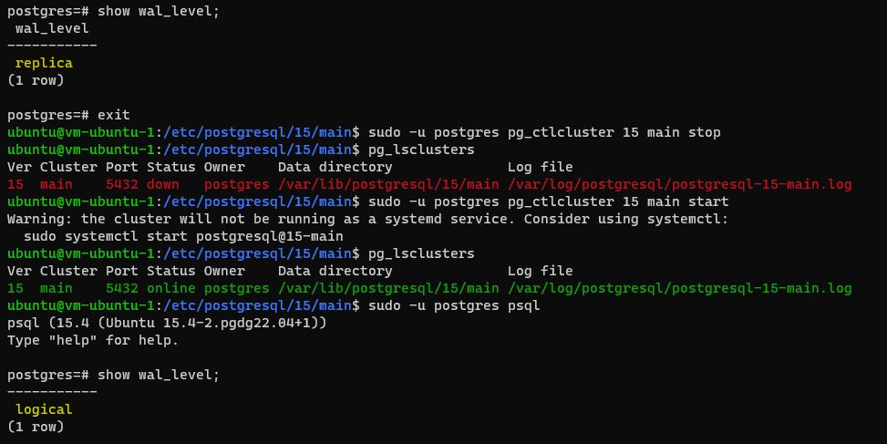
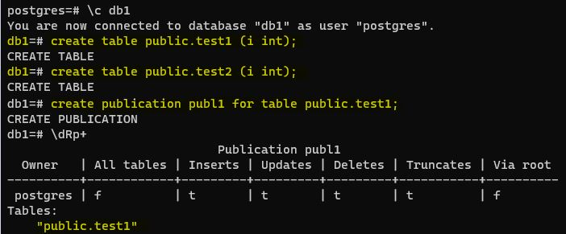

# Домашнее задание №10 (Тема "Виды и устройство репликации в PostgreSQL. Практика применения")

Описание/Пошаговая инструкция выполнения домашнего задания:

 __*Создал три виртуальные машины.*__
> 

 __*На каждой из трех виртуальных машин развернул кластер Postgres версии 15.*__
 __*Далее начал настраивать ВМ для логической репликации. Изменил значение параметра "listen_addresses", специальная запись * соответствует всем доступным IP-интерфейсам. Чтобы изменение применилось перезапустил кластер Postgres.*__
> 

 __*Далее внес изменения в файл "pg_hba.conf" в раздел "# IPv4 local connections", указав подсети наших ВМ и сделав доверительные связи. Это позволит нашим клиентам (client) подключаться к Postgres.*__
> 

 __*Следующее изменение - это установка для параметра "wal_level" значения "logical" вместо "replica". Чтобы изменение применилось перезапустил кластер Postgres.*__
> 

 __*Все перечисленные действия я проделал на всех трех виртуальных машинах.*__

* На 1 ВМ создаем таблицы test для записи, test2 для запросов на чтение.
  
 __*На первой виртуальной машине создал базу данных "db1". В ней в схеме public создал таблицы "test1", "test2". У вновь созданной таблицы "test1" сделал публикацию "publ1".*__
> 
* Создаем публикацию таблицы test и подписываемся на публикацию таблицы test2 с ВМ №2.
* На 2 ВМ создаем таблицы test2 для записи, test для запросов на чтение.
* Создаем публикацию таблицы test2 и подписываемся на публикацию таблицы test1 с ВМ №1.
* ВМ 3 использовать как реплику для чтения и бэкапов (подписаться на таблицы из ВМ №1 и №2 ).
  
